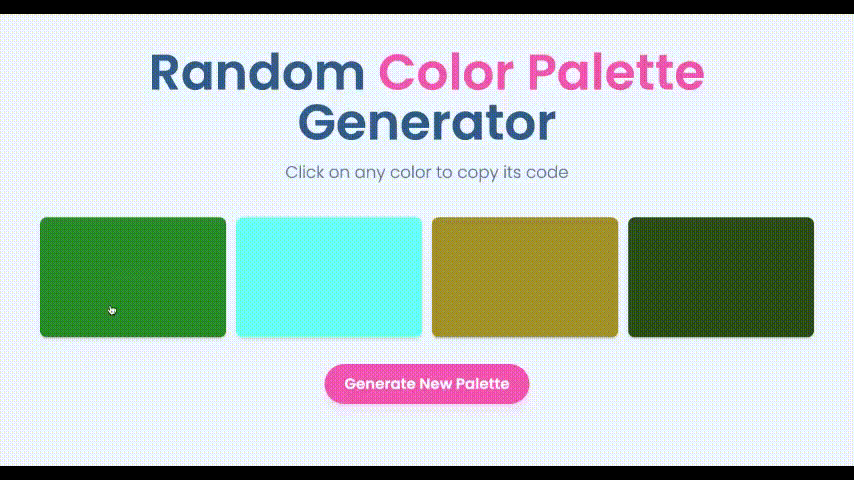

# Random Color Palette Generator

A modern web application for generating and exploring color palettes, designed with a focus on user experience and visual aesthetics.



## Design Philosophy

This project was inspired by the principles of modern UI/UX design, emphasizing:

- **Simplicity**: Clean, minimalist interface that puts focus on the colors
- **Accessibility**: High contrast and clear visual hierarchy
- **Interactivity**: Smooth animations and immediate feedback
- **Responsiveness**: Seamless experience across all device sizes

## Color Theory

The application's own design uses a carefully selected color palette:

- **Background**: Soft blue (#f0f7ff) - Creates a calm, professional atmosphere
- **Primary**: Deep blue (#2d5b8e) - Ensures readability and establishes hierarchy
- **Accent**: Pink (#ff69b4) - Adds personality and draws attention to interactive elements
- **Secondary**: Light blue (#91c4ff) - Provides subtle depth and dimension

## Features

- Generate random color palettes with a single click
- Copy color codes with one tap
- Responsive design that works on all devices
- Smooth animations and transitions
- Loading states with visual feedback

## Technical Stack

- Next.js
- Tailwind CSS
- React Hooks
- Axios for API calls

## Getting Started

1. Clone the repository
2. Install dependencies:
   ```bash
   npm install
   ```
3. Run the development server:
   ```bash
   npm run dev
   ```

## Design Decisions

### Layout
- Grid-based layout for consistent spacing
- Maximum width constraint for optimal readability
- Responsive breakpoints for different screen sizes

### Typography
- Poppins font family for modern, clean typography
- Clear hierarchy with different font sizes and weights
- Optimized line heights for readability

### Interactions
- Hover effects for better user feedback
- Smooth transitions for all interactive elements
- Clear loading states to indicate progress

### Color Display
- Shadow effects for depth
- Rounded corners for a friendly feel
- Semi-transparent overlays for color code visibility

## Future Improvements

- Color palette history
- Save favorite palettes
- Color accessibility checker
- Export palettes in different formats
- Color combination suggestions

## Contributing

Feel free to contribute to this project by submitting issues or pull requests.

## License

MIT License
